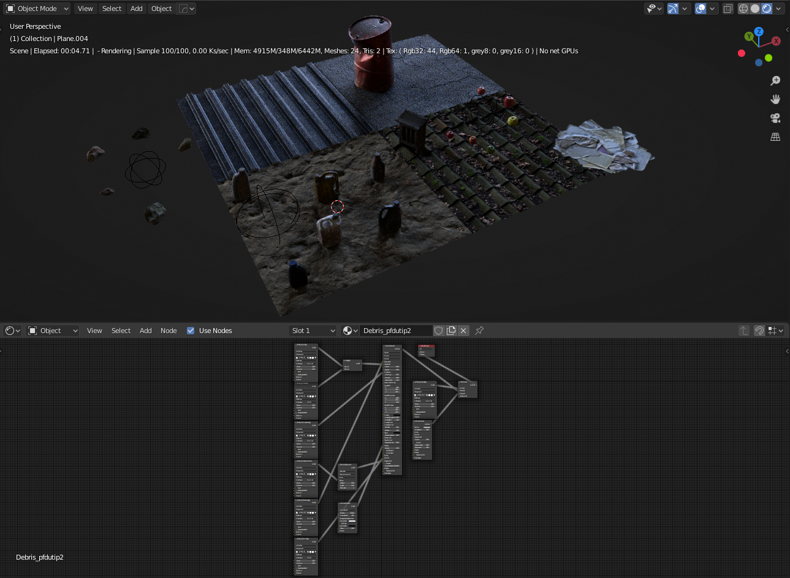
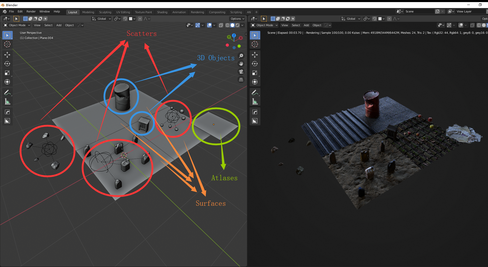

# MSLiveLink-OC-Blender
Quixel Megascans Plugin for Octane Blender Edition

## Versions

> Windows

[Quixel Official Documentation](https://help.quixel.com/hc/en-us/articles/360002425298-Installing-the-Megascans-Plugin-for-Blender-2-8)

MSLiveLink Octane version 1.3.0

Official base addon version 2.7

OctaneRender™ for Blender 2019 and later

## Installation

1. Download this repository as a zip and extract it
2. Right click on the MSLiveLink_Octane folder (not the MSLiveLink-OC-Blender-master) and select Send > As ZIP file
4. In Octane Blender, install the addon from the zip file
4. Activate it
5. **File > Import > Start Megascans LiveLink Octane** will activate a socket client listening to the Megascans Bridge
6. Open the Megascans Bridge and change the export method to Blender
7. Click export. Feel fun

## Upgrading

1. Remove the addon in the settings and relaunch the OC Blender 
2. Download this repository as a zip
3. Follow instructions to install the addon

Otherwise, socket running in the thread will cause a problem

## Features
> Please turn on the **Specular map** option when you download the assets or export them from the Bridge, otherwise, the specular value will be set to 0.5 by default

> Surface materials will not be assigned to selected objects, instead, you can find it in the material slots in Node editor

Minimum textures to get a correct response

Complete nodes setup

Textures info

| Textures         | Info                             |
| ---------------- | -------------------------------- |
| **Albedo**       | Added by default (If exists)     |
| **Displacement** | Added by default (If exists)     |
| **Normal**       | Added by default (If exists)     |
| **Roughness**    | Added by default (If exists)     |
| **Specular**     | Added by default (If exists)     |
| Opacity          | Added by default (If exists)     |
| Translucency     | Added by default (If exists)     |
| Metalness        | Added by default (If exists)     |
| AO               | Added by default (If exists)     |
| Bump             | Optional (Toggle in preferences) |
| Fuzz             | Optional (Toggle in preferences) |
| Cavity           | Optional (Toggle in preferences) |
| Curvature        | Optional (Toggle in preferences) |

